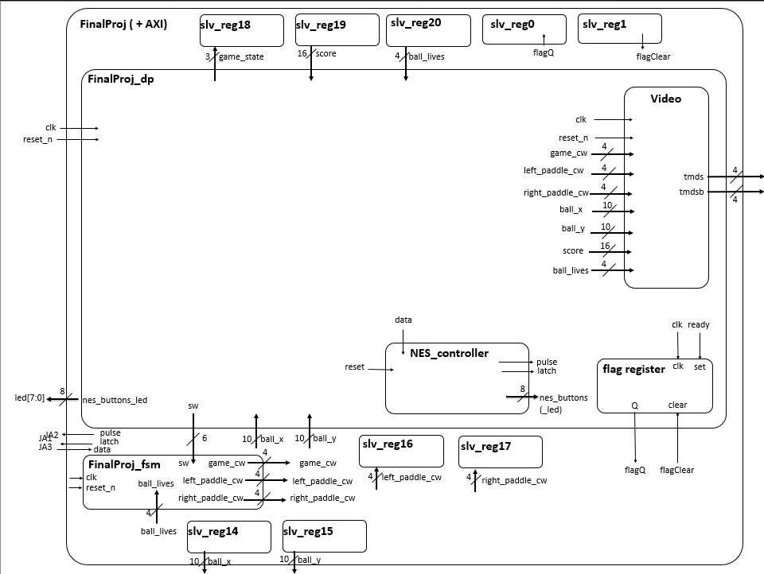
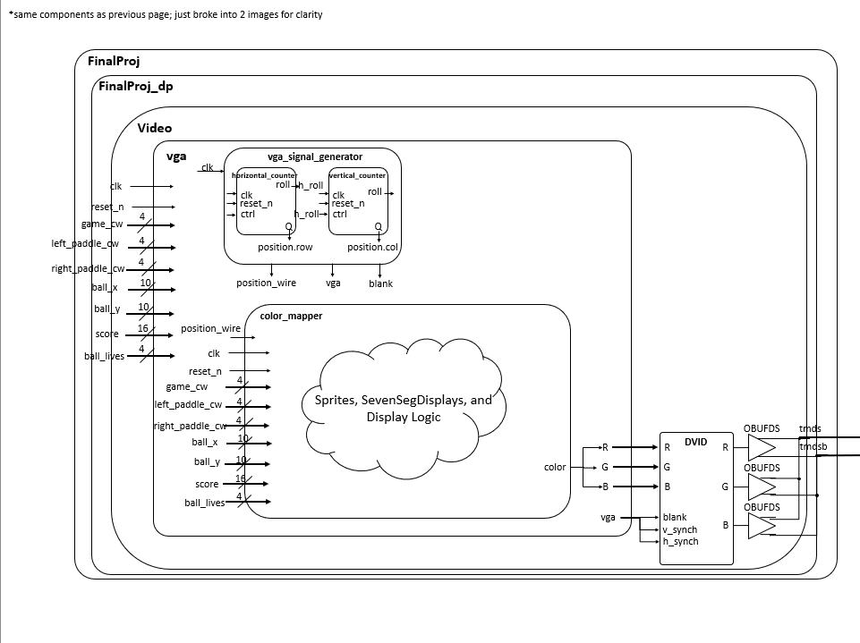
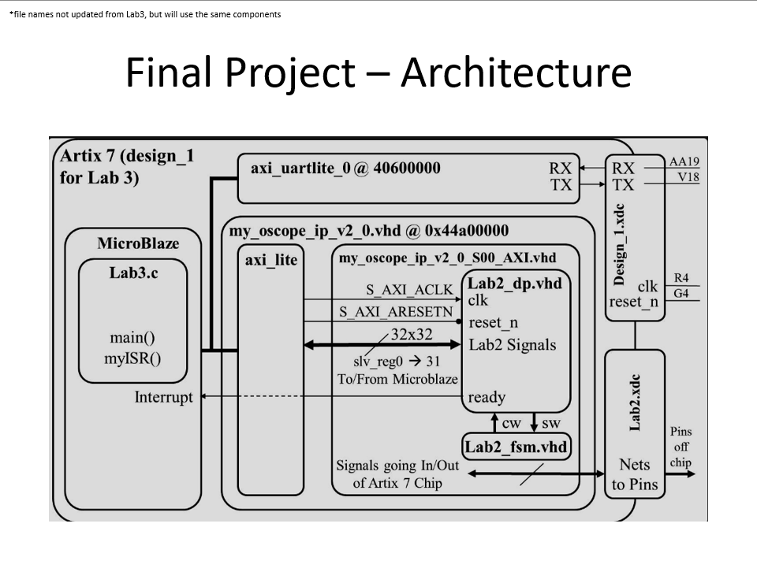
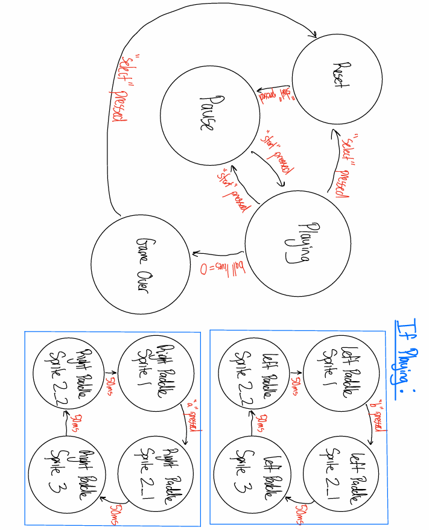
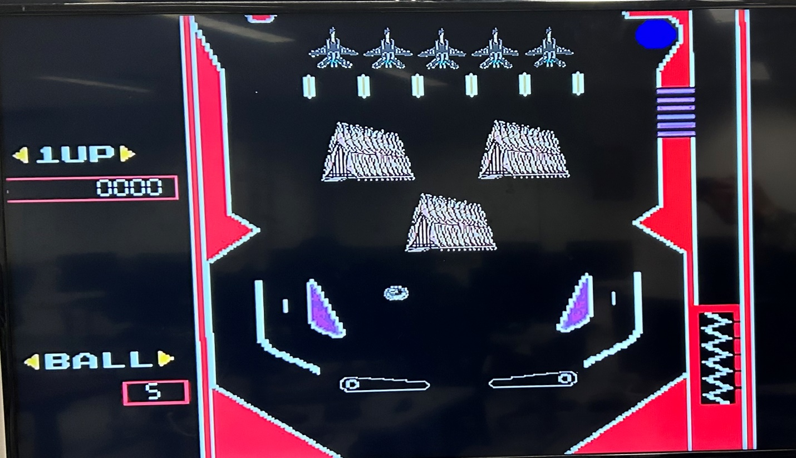

# ECE 383 Final Project: USAFA-Themed Pinball

**Name:** Jayden Randolph  
**Course / Section:** ECE 383  
**Instructor:** LtCol James Trimble  
**Date Submitted:** 08 May 2026  

## Proposal
The purpose of this project was to create a USAFA-themed virtual pinball machine using VHDL, C, an FPGA board, and an NES controller. The final design displays a full pinball table on-screen, reads NES controller inputs, controls the flippers, updates ball physics, tracks lives, and displays score using hardware-driven VGA output.

## Detailed Architecture and Subsystem Design

### Level 1 Design (Datapath)
The project uses a hardware/software split. The VHDL hardware handles video generation, sprite/background display, FSM logic, register interfaces, NES controller input, and the VGA/HDMI output path. The C software handles the main game loop, ball movement, collision logic, scoring, lives, and register updates.


*Figure 1. Level 1 block diagram architecture.*


*Figure 2. Video pipeline / block diagram architecture.*


*Figure 3. MicroBlaze and AXI architecture reference from the earlier lab structure.*

### Finite State Machine Design
The game logic uses separate finite state machines for the main game state and the left/right flippers. This allowed the flippers to operate independently instead of forcing only one flipper to move at a time.

Main game states include reset, pause, playing, and game over. The flipper FSMs handle each paddle’s animation sequence and are controlled by master pause flags so the paddles freeze during the pause state.


*Figure 4. Final project finite state machine.*

### Final Display
The final design generates a USAFA-themed pinball game on a 480-row by 680-column screen. The display includes the pinball table background, USAFA-themed sprites, ball, flippers, score, and ball/lives indicator.


*Figure 5. Final project display on-screen.*

## Equations

### Basic Ball Motion
```c
ball_x = ball_x + x_vel;
ball_y = ball_y + y_vel;
```

### Gravity
```c
y_vel = y_vel + gravity;
```
To prevent the ball from moving too fast and skipping through objects, I limited the x and y velocity values:
```c
if x_vel > MAX_SPEED_PIXELS, x_vel = MAX_SPEED_PIXELS
if x_vel < -MAX_SPEED_PIXELS, x_vel = -MAX_SPEED_PIXELS
```
(The same logic was used for y_vel)


### Wall Bounce
When the ball collided with a wall or colored background pixel, I reversed the velocity:
```c
x_vel = -x_vel
y_vel = -y_vel
```
To make the bounce slightly less aggressive, I multiplied the velocity by a bounce fraction:
```c
x_vel = (x_vel * WALL_BOUNCE_NUM) / WALL_BOUNCE_DEN
y_vel = (y_vel * WALL_BOUNCE_NUM) / WALL_BOUNCE_DEN
```
Through my planning phase for the collision, ChatGPT recommended I add the bounce fraction as a quick and easy improvement to the ball’s mechanics.


### Rectangle Collision
For the flippers, I used box collision. The ball’s collision box was calculated from its center and radius:
```c
ball_left = ball_x - BALL_RADIUS
ball_right = ball_x + BALL_RADIUS
ball_top = ball_y - BALL_RADIUS
ball_bottom = ball_y + BALL_RADIUS
```
A collision happens when the ball’s box overlaps the object’s box:
```c
ball_right >= object_left
ball_left <= object_right
ball_bottom >= object_top
ball_top <= object_bottom
```
If all four of these are true, then the pinball is “touching” the object and collision occurs


### Pixel Collision
For the background, I used pixel collision instead of rectangle collision. I was brainstorming via the internet to solve the background collision, and a forum recommended I implement pixel collision. I converted the background into a collision mask where:
```c
0 = free space / black pixel
1 = collision / colored pixel
```
Since each collision value only needs one bit, I packed 8 pixels into each byte. To check if a pixel was solid, I used:
```c
byte_index = x / 8
bit_index = 7 - (x % 8)
```
Then I checked the bit:
```c
solid = row_byte & (1 << bit_index)
```
If this value was not zero, the pixel was colored and counted as a collision point. Note: the bit_index and the location of the pinball were flipped, hence the “7-…” part of the bit_index.


### Ball Lost
Ball Lost:
The top of the screen was treated as a wall, but the bottom of the screen was treated as the drain. If the ball went below the drain value, the ball was lost:
```c
if ball_y - BALL_RADIUS > DRAIN_Y:
ball_lives = ball_lives - 1
resetBall()
```


### Score Calculation
The score increased when the ball hit a flipper:
```c
score = score + SCORE_PER_HIT
```
I kept running into issues where the score would run up extremely fast, so I added a delay to prevent multiple collisions registering in the same frame:
```c
if score_cooldown == 0:
score = score + SCORE_PER_HIT
score_cooldown = SCORE_COOLDOWN_TICKS
```

### Score Display / BCD
The score was displayed using a VGA version of my seven-segment decoder from ECE 281. The C code converted the score into BCD (Binary-Coded Decimal) before sending it to the hardware. Each decimal digit is stored in 4 bits where:
```c
score[15:12] = thousands
score[11:8] = hundreds
score[7:4] = tens
score[3:0] = ones
```
For example, a score of 1234 is sent as:
0x1234
Then, the C calculation to push the score back into 16 bits was:
```c
BCD_score = (thousands << 12) | (hundreds << 8) | (tens << 4) | ones
```


### NES Controller Timing
The NES controller sends 8 bits of button data. The latch signal stores the button states, and then the pulse signal shifts each button bit out one at a time.
The total read time was:
```text
t_read = t_latch + 8 * t_clk
```
And for my design:
```text
t_read = 60 μs
```
This timing allowed the FPGA to read all 8 NES controller buttons correctly. C1C Jake Miller helped me figure this out.

## Milestones and Results

### Milestone I
**Goal:** All sprites displayed properly on the screen, but not necessarily in the correct position. NES controller is not necessarily working. Physics not required.

**Result:** On Tuesday, 28 April 2026 around 1030 I met this requirement. All of the sprites displayed properly on the screen, but were in the wrong position. I did not implement the NES controller or any physics. A few days later, I simplified my sprites to be one background using piskel.

### Milestone II
**Goal:** NES controller inputs work/respond appropriately. All sprites in the correct location and to scale. Physics not required. 

**Result:** On Friday, 8 May 2026 around 1500 I met this requirement. Even though the finite state machine was broken which prevented the NES controller from interacting with the paddles, I wired the NES controller to the board’s LEDs. All of the LEDs lit up properly when their respective NES button was pressed. Additionally, all sprites were loaded in the correct location and to the correct scale. Besides a few pixel readjustments of the paddles’ location, none of the sprites were changed before the final submission.

## Functionality and Requirements

### Minimum Functionality
- Sprites generate.
- Paddles work, but not all buttons on the NES controller necessarily work.
- Major ball physics glitches are acceptable.

### B-Level Functionality
- Pinball background generated on-screen. Not necessarily USAFA themed
- NES controller works and can interact with the game. All buttons paired correctly.
- Basic gameplay possible. Scoring and minor ball physics bugs are ok. 

### A-Level Functionality
- USAFA-themed pinball game fully generated on-screen. 
- Compatible with the FPGA on LtCol Trimble's arcade machine. 
- Fully functioning NES controller. 
- No scoring or ball physics bugs. 
- Scoring system fully functional and logical.

## Final Demonstration and Test Results
In the end, I was able to meet full A-Level functionality. A USAFA-themed pinball game was fully generated on screen, is compatible with LtCol Trimble’s arcade machine, utilizes a fully functioning NES controller, and has a fully functional and logical scoring/lives system. However, the game is not perfect. There are still a few very small physics bugs that make the game clunky at times. However, after pouring over 50 hours into this final project, I can confidently say the physics bugs do not cause a major hinderance to the game. If I had another 20 hours to put towards this assignment or full access to AI throughout this assignment, I would look to add sound effects and implement pixel collision in leu of rectangle collision.
Due to time constraints in this lab, I was unable to achieve a perfect USAFA pinball game. However, I accomplished everything I desired. I was able to recreate the NES pinball game at a basic level while adding USAFA sprites to the game. Initially, I wanted to add sound effects to the game, but after clearing the first milestone I knew that was unrealistic for the ~3-weeks I had to finish this project. Additionally, the game has minor collision glitches you will see when playing. Due to limited use of AI and time constraints, I chose to use box collisions. However, the pinball and paddle sprites are not perfectly centered around the ball/paddle. Thus, you will notice that the ball collides with the paddles even though the sprite itself does not touch the paddles. To fix this, research pointed towards pixel collision, where I represented every pixel as colored or not colored and ran collision based on that. I utilized this method for collisions with the background, but since the code for that took so long to write, I ran out of time to implement the same logic into the pinball and paddle sprites. I estimate around 5 hours with full AI access would solve the physics bugs and implement sound effects, and around 20 hours of no-AI access would let me add/fix these features.

## Problems Encountered

### Coding First, Thinking Later
First, I tried jumping into the project without fully understanding what I was writing in VHDL (hardware) and what I was writing in C (software). Since bitstreams for the FPGA board took around 20 minutes to generate each time, I should have written all of my hardware code from the start and then moved on to my C code. For instance, I should have mapped my background, added my seven_seg_decoder, finite state machine, registers, and NES controller during the first two weeks. Then, I would never have to generate another bitstream and could stay on the software side for the rest of the project. Yet, I did not do this. Instead, I wrote the C code while my bitstreams were generating. After a while, I started running into hardware errors that caused my registers to change. In doing so, the previous hours I spent writing software was pointless; the code was not needed anymore. 

### FSM Not Triggering Properly
The next major issue was my finite state machine not triggering properly. Initially, I had the flippers and game logic under the same finite state machine. This caused the flippers to only be able to be pressed one at a time. That is not how a real pinball game works, so to trouble shoot this I created 3 finite state machines – one for each flipper and one for the game’s states. This solved the problem, and the flippers operated asynchronously from the game states. Master flags in my FSM file controlled the flippers pausing during the “pause” state.

### Wrong RGB Values
Another major issue I ran into was different colors displaying on the screen compared to what I generated in piskel. I tested this by dividing my screen into 3 sections and displaying all red, all green, and all blue on each section. Once I did this, I found the screen displayed green, red, and blue. I found that in my video file, I swapped the signals for green and red. I thought I remapped green and red to their correct components, labeled OBUFDS_red and OBUFDS_green, but I actually swapped them to the wrong order. In reality, the colors are off because Windows 216 palette, the palette I used for all of my sprites, does not have enough bits to represent the images’ true color.

### NES Controller Timing
Additionally, I ran into major issues with the NES controller timing. I had to utilize significant documentation to understand how the timing worked, and C1C Jake Miller game me a lot of tips on how to correctly time the pulse, latch, and data. Once I got the component to work, I realized I had no way of testing if it worked since my game’s finite state machine was broken. Thus, I added LED logic on the bottom of the FPGA board to ensure everything work. Once I did this and confirmed it worked, I did not need to touch the component for the rest of the lab.

### Collision Bugs / Lack of Time
Finally, the last major issue I ran into during the lab was coding the collision of the pinball. By this point in lab, I had abandoned my C code and focused solely on the hardware. Once I had the hardware working and went back to the C code, I was short on time and had changed so much that my old C code was irrelevant. Thus, essentially started from scratch. I used AI to convert my .c image files to an array that has 0s and 1s representing non-colored pixel and colored pixel. I used these arrays to serve as collision points for my pinball. From there, I created my main function that constantly updates the game and a lot of helper function to handle the game’s logic. The 3 states were read into the software, and the software returned the ball’s coordinates, lives, and score. While you will see other registers in the code, they are remnants of previous iterations of the software and are not used. I kept them in since they did not cause any issues, and I did not want to create unknown problems by removing them.

### Closing Comments
Overall, this was my favorite project I have ever done at USAFA. Everything I learned this year in ECE 383 was put to the test, and this project proves how much I took away from this course. I spent 50+ hours on this project to get full functionality, and if you asked me to do it again I would do it in a heartbeat (and hopefully in half the time). 
In the future, I would recommend allowing students full access to AI on the final project. At the Naval Academy, we were able to use full AI on our final project, and I felt like I was able to accomplish a lot more in even less time. I believe AI automates the grindy part of the lab – syntax, logic, error debugging, etc. However, the core part of computer engineering – establishing a strong finite state machine, creating clear objectives for the problem, and debugging hardware/software, will still be accomplished.

## Poster Presentation


## Appendix A: Running the Project
1. Plug the computer into the FPGA board using the same setup as Lab 3.
2. Plug in an NES controller.
3. Set up Vitis using my `design_1_wrapper.xsa` file.
4. Run my `helloworld.c` in Vitis.
5. If Vitis setup fails, reference the ECE 383 ICE 3 MicroBlaze setup tutorial.

## Documentation Statement
Received help from LtCol Trimble in class to explain the logic behind drawing sprites and classmates for debugging the NES timing. Used Claude AI to generate sprites and give advice on what signals to pass to a register. Did not use any AI to code any part of this final project. If AI was consulted for specific parts of the code, I documented the usage appropriately in the code. Did not copy nor use any AI-generated code/solutions to my problems. Used ChatGPT to convert this word doc into a README.md.
