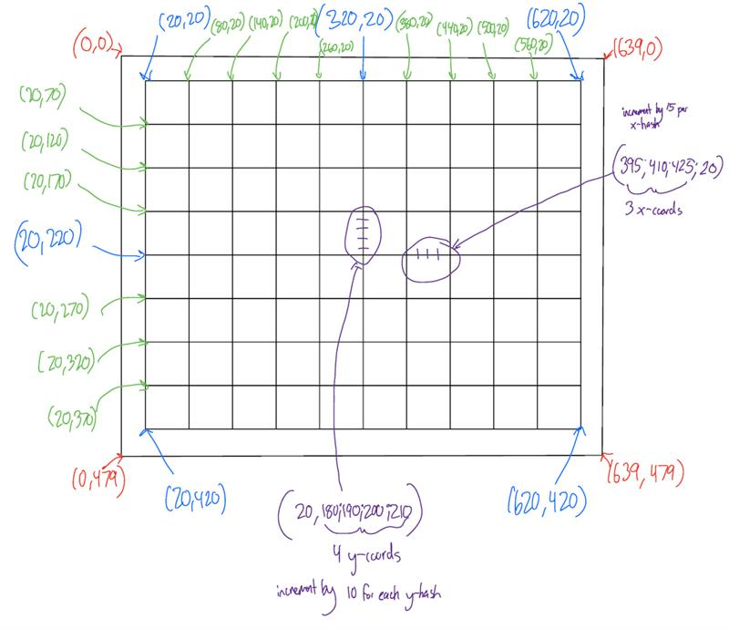

# Lab 01: VGA Synchronization

## Introduction
In this lab, we created a VGA controller in VHDL on our FPGA boards using counters, triggers, processes, and combinational logic. This report provides an overview of the design, implementation, testing, and results of our project.

## Design/Implementation
### Diagram

### Entities

#### lab1

#### numeric_stepper

#### debouncer

#### video

#### DVID

#### clock_wiz_0

#### vga

#### color_mapper

#### vga_signal_generator

#### counter

## Test/Debug

### hsync high, low, high in relation to column count

### vsync high, low, high in relation to row count and column count

### blank signals high, low, high in relation to column count and row count

### column count rolling over causing row count to increment and max counts for both counters

### Major Problems

#### Ch1 and Ch2 not appearing on screen

#### Triggers not initializing at center axises

#### Bitstream taking forever to generate

## Results

### Gate Check 1

This section should clearly state for each milestone/functionality the date/time it was achieved, level of achievement (e.g, achieved, partially-achieved, not achieved), what was achieved, and evidence you proved it worked (e.g., via demo or images/videos). We no longer use the printed lab cutsheets signed by your instructor as you meet each milestone, but instead have you make a submission in Gradescope and Github for each milestone.

### Gate Check 2

This section should clearly state for each milestone/functionality the date/time it was achieved, level of achievement (e.g, achieved, partially-achieved, not achieved), what was achieved, and evidence you proved it worked (e.g., via demo or images/videos). We no longer use the printed lab cutsheets signed by your instructor as you meet each milestone, but instead have you make a submission in Gradescope and Github for each milestone.

## Conclusion

Explain what your learned from this lab and what changes you would recommend in future years to this lab or the lectures leading up to this lab.