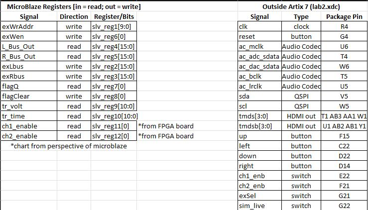
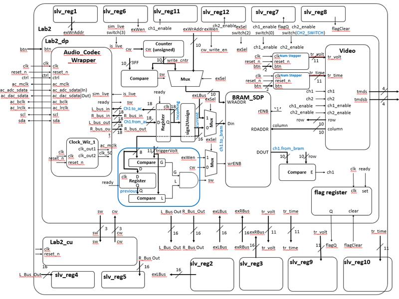
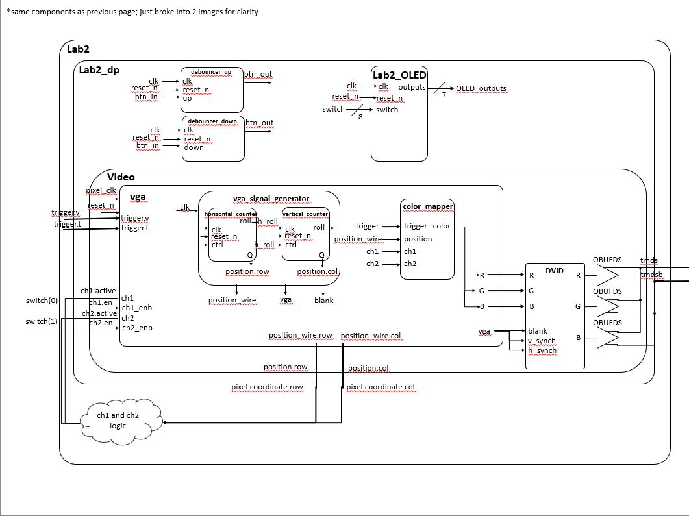
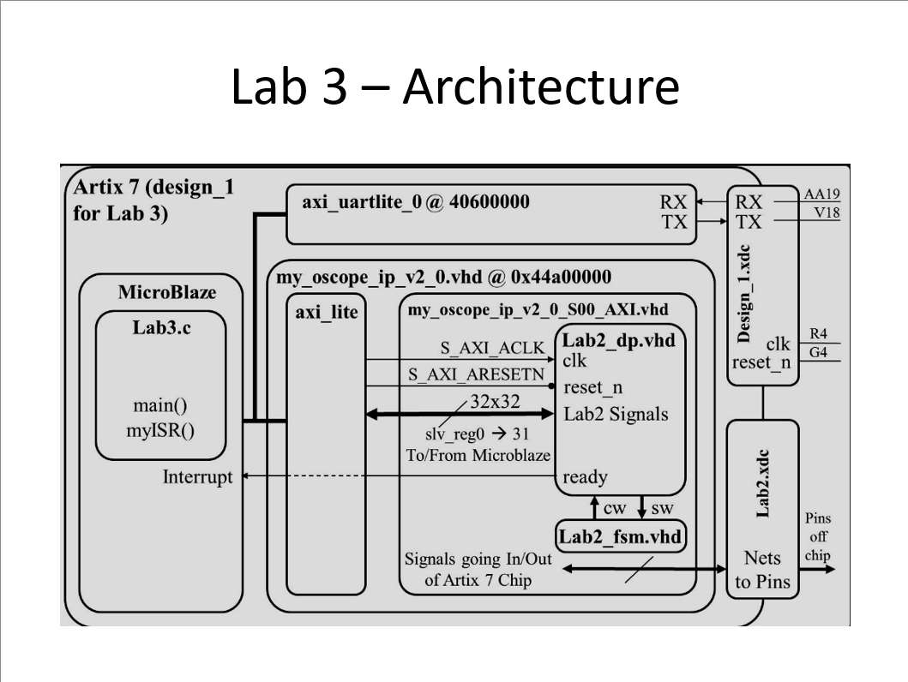

# Lab 03: Software Control of a Datapath

**Name:** C1C Jake Miller and C2C Jayden Randolph  
**Course / Section:** ECE 383 / T1  
**Instructor:** LtCol James Trimble  
**Date Submitted:** 2 Apr 2026  

## Introduction
In this lab, I integrated the basic 2-channel oscilloscope with a microblaze controller and the ability to toggle between the FSM and microblaze to control the 2-channel oscilloscope while adding trigger time control. This report provides an overview of the design, functionality, and conclusion of the lab.

## Design/Implementation

### Block Diagram

Block diagrams showing all components and (pretty much) every wire in this project

### Map of 32 AXI Registers to Lab 2 Signals

 
Map of the registers used with the Lab 2 signals

### Verifying Functionality

FINISH THIS!!!!!

To verify functionality, I primarily used the FPGA board. Through each gate check, I generated a bitstream and uploaded the bitstream to the FPGA board. Once on the board, I attempted to complete the each gate check's/the final functionality's requirements. If the bitstream failed to generate, the I would first check the component that caused the bitstream to fail. If I still could not get the bitstream to generate, I utilized Vivado's Integrated Logic Analyzer to determine which signal in my code was not processing correctly. Through all of these resources, I was able to achieve full functionality in this lab.

## Results

### Gate Check 1
Fully achieved required functionality at 1620 on 12 Mar 2026. Submitted diagrams via gradescope and achieved the required "baby step" from the "Implementation and Testing" section. Uploaded all code to Jake's Github.

### Gate Check 2
Fully achieved required functionality at 1620 on 12 Mar 2026. Submitted via instructor demo. Generated a bitstream, and Lab 2 functionality still works on our new bitstream. Uploaded all code to Jake's Github.

### Gate Check 3
Fully achieved required functionality at 1419 on 9 Mar 2026. Submitted via instructor demo. First part of instructions ("baby step") completed. Uploaded all code to Jake's Github.

### Required Functionality

FINISH THIS!!!

### A Functionality

FINISH THIS!!!

### Final Submission

FINISH THIS!!!

Achieved full functionality on 05 March 2026. Submitted via video demo in gradescope. Fully triggered live and simulated audio works, trigger's work, flag register component added, and debouncers implemented. Uploaded all code to Github.

## Conclusion
We learned a lot more about Vitis, VHDL, and C in this lab. We got even better learning Vivado's capabilities and how to use C code in Vitis. In future labs, we would like the pseudocode explained a little more in-depth - especially after the third gate check. We're not sure if we'll use Vitis again in the next lab, but understanding how to sync the microblaze to the FPGA board was extremely helpful for the final project where we will likely use C code.